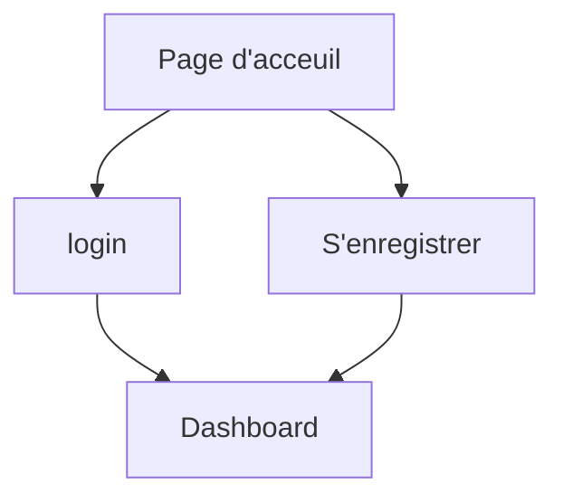

# UserProvider

---

## Schéma de fonctionnement


```sequence
user1->userprovider: Create an account on userprovider
Note over userprovider: User1 is user\n of userprovider
user1->userprovider: login


userprovider->user1:token

user1-->userprovider: (use token)\n Create application app1
Note over userprovider: verify token and role

Note over userprovider: User1 is admin \n of app1

user2->userprovider:Create account for app1
Note over userprovider: User2 is user \n of app1

user2->userprovider:Login

userprovider->user2:token
user2-->app1: Use token
Note over app1: verify token and role

app1-->user2: return ressource


```

## Description

## Table

### User

| Champs    |      |      |
| --------- | ---- | ---- |
| _id       |      |      |
| firstname |      |      |
| lastname  |      |      |
| username  |      |      |
| email     |      |      |
| password  |      |      |
| roles     |      |      |
| apps      |      |      |

```json
{
    data :{
        _id:1,
        firstname: "Didier",
        lastname: "Page",
        username: "dpage",
        email: "page.didier@gmail.com"
        password: "kvwdbwqéoncéadnc",
        apps :[
        	id: <appId>
        	roles: [id1,id2,id3]
        ]
    },
    error: false,
}
```


### Role

| Champs |      |      |
| ------ | ---- | ---- |
| _id    |      |      |
| name   |      |      |

```json
[
    data: {
        {
        	 _id:2,
        	name: "ADMIN",
    	},
    	{
    		 _id:3,
        	name: "USER",
		},
		{
    		_id:6,
            name: "GOD"
		}
    },
    error: false,
]
```


### App

| _id   |      |      |
| ----- | ---- | ---- |
| name  |      |      |
| url   |      |      |
| roles |      |      |
| users |      |      |

```json
{
    data: {
        {
        	_id: 4,
        	name: "userprovider",
    		user:[
    			id: <userId>
        		roles : [id1,id2,id3]
   			]
    	},
    },
    error:false,
}
```

---

## Droit

On peut ... en temps que :

### Publique

- ... s'enregistrer
- ... se logger

### User

- ... créer une application
- ... modifier/supprimer (son)ses application(s)
- ... ajouter des roles inexistants 
- ... lister ces applications
- ... lister les users de chaque application
- 

### Admin

- ... passer un USER en ADMIN
- ... lister toutes les application
- ... lister tout les users
- ... lister tout les roles
- ... modifier un role

---

## Hiérarchie du site

